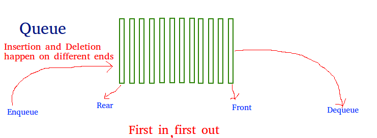

# Queue

- Overview
- Applications
- Common Procedures
- Design & Implementation
- Implementation Examples

## Overview



A _Queue_ is a linear structure which follows a FIFO order for operations.

> In a **queue**, the element deleted is always that one that has been in the set for the longest time: **first-in, first-out**, or **FIFO**.

There are several implementations, we will focus on a simple array to implement each.

## Application

Queue is used when things don't have to be processed immediately, but have to be processed in \*_FIFO_ order like _Breadth First Search_. This property of _Queue_ makes it also useful in following other scenarios:

- A resource is shared among multiple consumers.
  - CPU Scheduling
  - Disk Scheduling
- Data is transferred asynxchronously (not necessarily received at same rate as sent) between two processes.
  - IO Buffers
  - Pipes
  - File IO
- Operating Systems
  - Semaphores
  - FCFS (First Come First Serve) scheduling
  - Spooling in printers
  - Buffer for devices like keyboard
- Networks
  - Queues in routers/switches
  - Mail Queues

## Common Procedures

```
ENQUEUE(Q, x)
  Q[Q.tail] = x
  if Q.tail == Q.length
    Q.tail = 1
  else Q.tail = Q.tail + 1

DEQUEUE(Q)
  x = Q[Q.head]
  if Q.head == Q.length
    Q.head = 1
  else Q.head = Q.head + 1
  return x
```

## Design & Implementation

- Array Implementation
- Linked List Implementation
- Stack Implementation

### Array Implementation

- Time Complexity O(1) for enque & deque.
- Space Complexity O(N) for N elements to store.
- Easy to implement
- Static Data Structure -> fixed size.
- If the queue has a large number of enqueue and dequeue operations, at some point (in case of linear increment of front and rear indexes), we may not be able to insert elements in the queue even if the queue is empty.

### Linked List Implementation

- Time Complexity O(1) for enque & deque.
- Space Complexity O(N) for N elements to store.

### Stack Implementation

- A queue can be implemented using _two stacks_. You need to decide whether to make enqueue or dequeue operation costly O(N) and the other one O(1).
- Space complexity O(N)

#### Enqueue costly O(N)

This method makes sure the oldest entered element is always at the top of stack 1, so that the dequeue operation just pops from stack1. To put the element at top of stack1, stack2 is used.

- While stack1 is not empty, push everything from stack1 to stack2.
- Push x to stack1 (assuming size of stacks is unlimited)
- Push everything back to stack1.

#### Dequeue costly O(N)

This method push new elements at the top of stack1. In dequeue operation, if stack2 is empty, then all the elements are moved to stack2 and finally top of stack2 is returned.

## Implementation Examples

### Java

`java.util` provides a `Queue` interface that extends the `Collection` interface, and the most common concrete classes that implement it are `PriorityQueue` and `LinkedList` (both implementations are not thread safe, `PriorityBlockingQueue` is one alternative implementation if thread safe implementation is needed)


See more examples in my [Datastructures in Java repositroy]((https://github.com/herrera-ignacio/datastructures-in-java/tree/master/src/main/java/linear/queue).
