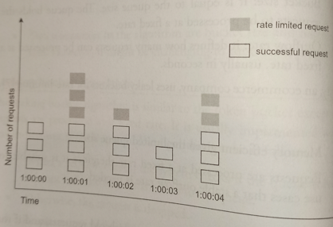
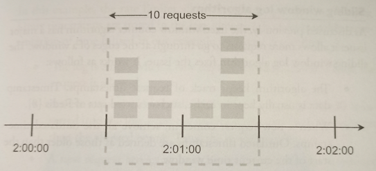

# Fixed Window Counter

- Overview
- Pros
- Cons

## Overview

- The algorithm divides the timeline into **fix-sized time windows and assign a counter for each window**. Each request increments the counter by one. **Once the counter reaches the pre-defined treshold, new requests are dropped until a new time window starts**.

## Pros

- Memory efficient.

- Easy to understand.

- Resetting available quota at the end of a unit time window fits certain use cases.

## Cons

Spike in traffic at the edghes of a window could cause more requests than the allowed quota to go through.

> In this example, the system allows a maximum of 5 requests per minute, and the available quota resets at the human-friendly round minute. As seen, there are five requests between 2:00:00 and 2:01:00 and five more requests between 2:01:00 and 2:02:00. For the one-minute window between 2:00:30 and 2:01:30, 10 requests go through. That is twice as many as allowed.
