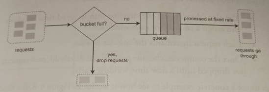

# Leaking Bucket

- Overview
- Pros
- Cons

## Overview

> _Shopify_ uses leaky buckets for rate-limiting.

- When a request arrives, the system checks if the queue is full. **If it is not full, the request is added to the queue**. Otherwise, the request is dropped. **Requests are pulled from the queue and processed at regular intervals**.

- It takes two parameters:

  - _Bucket size_: It is equal to the queue size. The queue holds the requests to be processed at a fixed rate.
  - _Outflow rate_: It defines how many requests can be processed at a fixed rate, usually in seconds.

- Similar to the _Token Bucket_ algorithm except that **requests are processed at a fixed rate**.

- It is usually implemented with a **FIFO queue**.

## Pros

- Memory efficient given the limited queue size.

- Requests are processed at a fixed rate and therefore it is suitable for use cases that a stable outflow rate is needed.

## Cons

- A burst of traffic fills up the queue with old requests, and if they are not processed in time, recent requests will be rate limited.

- It might not be easy to tune _bucket size_ and _outflow rates_ parameters properly.
