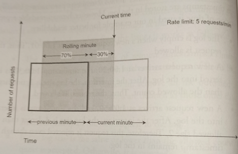

# Sliding Window Counter

- Overview
- Pros
- Cons

## Overview

Hybrid approach that combines the _fixed window counter_ and _sliding window log_ algorithms. There are various implementations. We'll cover only one of them:

Assume the rate limiter allows a maximum of 7 requests per minute, and there are 5 requests in the previous minute and 3 in the current minute. For a new request that arrives at a 30% position in the current minute, the number of requests in the rolling window is calculated using the following formula:

- Requests in current window + requests in previous window \* overlap percentage of the rolling window and previous window.

- Using this formula we get 3 + 5 \* 0.7 = 6.5 requests. Depending on the use case, the number can either be rounded up or down. In our exampl, it is rounded down to 6.

Since the rate limiter allows a maximum of 7 requests per minute, the current request can go through. However, the limit will be reached after receiving one more request.

## Pros

- It smooths out spikes in traffic because the rate is based on the average rate of the previous window.

- Memory efficient.

## Cons

It only works for not-so-strict look back window. it is an approximation of the actual rate because it assumes requests in the previous window are evenly distributed.

> This problem may not be as bad as it seems. [According to experiments done by Cloudflare](https://blog.cloudflare.com/counting-things-a-lot-of-different-things/), only 0.0003% of requests are wrongly allowed or rate limited among 400 million requests.
