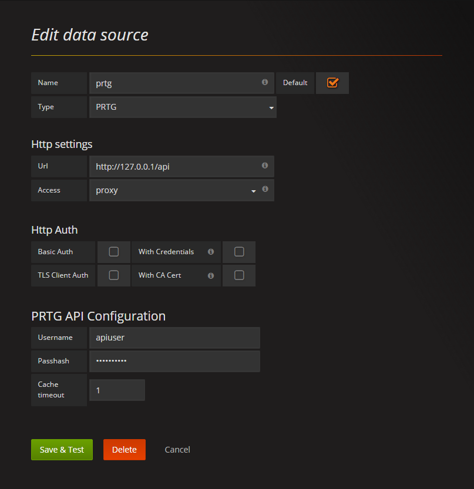

# Preliminary Setup

_The following only needs to be done once, the first time Grafana is installed._

- [Install instructions from Grafana](https://grafana.com/docs/grafana/latest/installation/)
- **To upgrade:** (Windows) First, **backup**. Then, download a newer package from the install link above and extract to the same location (and overwrite the existing files). **This might overwrite your config changes.** Save a copy of the config to the desktop, prior to upgrading - from `C:\Program Files\GrafanaLabs\grafana\conf\custom.ini` as this will make upgrades easier without risking losing your config changes. Shut down the Grafana service, else you'll be prompt for a system reboot to complete the upgrade. _If custom.ini gets wiped during the upgrade, it is also wise to diff the new custom.ini with your backup, incase new options were added._

### Create a User in PRTG for API Access

1. Create an API user group, with restricted permissions. Setup > System Administration > User Groups > **+** > Add User Group

Use the following options:

| Option                   | Value                                      |
| ------------------------ | ------------------------------------------ |
| **User Group Name**      | API                                        |
| **Use Active Directory** | No                                         |
| **Allowed Sensors**      | Users may create certain sensor types only |
| **Members**              | _(add grafana here, later)_                |

2. Setup the Grafana user. Setup > System Administration > User Accounts > **+** to add a new user

Use the following options:

| Option                 | Value                                     |
| ---------------------- | ----------------------------------------- |
| **Account Type**       | Read-only user                            |
| **Acknowledge Alarms** | User may not acknowledge alarms (default) |
| **Primary Group**      | API                                       |
| **Date Format**        | MM/DD/YYYY HH:MM:SS (AM/PM)               |

Save the user.

Now, obtain the Passhash by clicking the **Passhash** button, after the page refreshes.

3. Go back to the **API** group and add **grafana** to it.

4. Go to your **Root** group, probably at `https://prtg.example.com/group.htm?id=0&tabid=8` (change URL to suit your setup) > > scroll to "Access Rights" > adjust API > Read access > Save

Worth noting:

- _If you try to enable the API in Grafana by using the password, authentication will fail._
- _When the user’s password is changed, the passhash will change, also._

---

You will need to configure PRTG to add an `Access-Control-Allow-Origin` HTTP header. This can be done in two simple steps:

1. Add a String value named `AccessControlAllowOriginHTTPHeader` to the registry key: `HKLM\Software\Wow6432Node\Paessler\PRTG Network Monitor\Server\Webserver`
   

2. Go to `services.msc` and restart the `PRTG Core Server` service

**Plugin Setup**

1. Obtain the plugin from https://github.com/neuralfraud/grafana-prtg
2. Click the green **Clone or Download** Button
3. Select **Download ZIP** and save
4. Unzip the downloaded file > Navigate to the `jasonlashua-prtg-datasource` directory; drag `jasonlashua-prtg-datasource` into the Grafana directory (on the Grafana server): **data/plugins** - on a Windows machine, this is `C:\Program Files\GrafanaLabs\grafana\data\plugins`
5. Go to `services.msc` and restart the **Grafana** service
6. Select the **Datasource** page and click the "**Add new**" button
7. Under Edit Data Source, Choose a simple name, e.g., "PRTG" and select "prtg" as the data source type.
8. Under HTTP Settings, provide the API URL (http://prtg.example.com/api)
9. Typically you should chose "**Server**" as the **access** mode unless you specifically want the web browser to directly communicate with PRTG
10. Skip the **Http Auth** section
11. Under **PRTG API Configuration**, provide the username for the account you will be accessing the API as. For the passhash, you will find this in the PRTG account page for that user. **Providing the password will not work.** 
12. Click the "Test Connection" button to verify your datasource connection #
