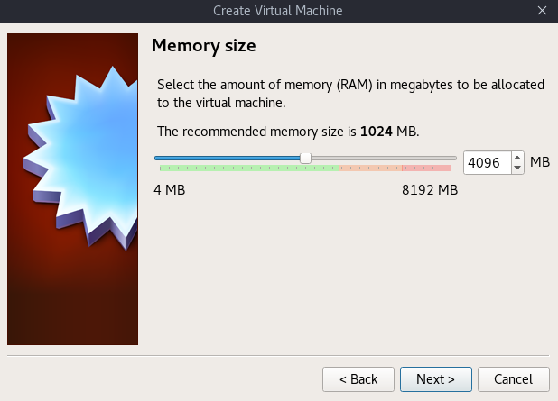
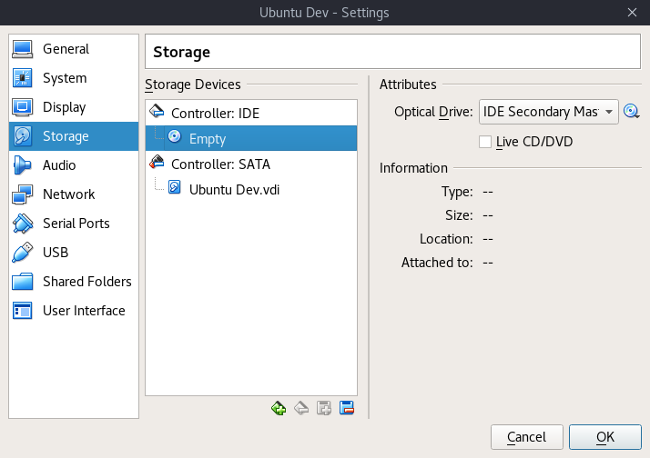

# Basic Ubuntu VirtualBox VM Setup

- First, [install VirtualBox](https://wiki.debian.org/VirtualBox#Debian_9_.22Stretch.22)

- Download an ISO image from [Ubuntu](https://www.ubuntu.com/download/desktop) to use as the virtual machine.

- Save it somewhere so it can be quickly re-provisioned for multiple machines when you decide to trash your sandbox. I keep mine on a second hard drive under `/storage/hdd/virtualbox`

- Launch Virtualbox




- Select New > select defaults; but maximize the amount of RAM given to the guest OS, as it is released back to the host system when not in use by VirtualBox



### Attach the ISO

- Select the new Ubuntu VM in the list to highlight > click Settings on the primary menu > Storage

* Under **Storage Devices**
* Select Controller: IDE > Empty > on the far right of the next menu, under Attributes > Optical Drive > push the CD icon > Choose Virtual Optical Disk File > navigate to where you left the .iso file for Ubuntu and select it > hit OK and close out the menu

### Allow copy and paste from the host machine to the VirtualBox VM

- Select the new Ubuntu VM in the list to highlight > click Settings on the primary menu > General > Advanced and change the following:
- Shared clipboard: bidirectional
- Drag n drop: bidirectional

- Click OK, save and start the machine > proceed through the guided installation process > After reboot, it'll prompt you to remove the installation medium and hit Enter - just hit enter, since there is no installation medium.

- After you're booted up and logged in, on your keyboard, hit the key combo: **Cntrl Alt T**, to launch the terminal

- Run the following in the terminal to install the package needed to enable copy and paste:

```bash
sudo apt update && apt install virtualbox-guest-x11
```

- Once install is complete, reboot for the changes to take effect:

```bash
reboot
```

- Once you're back in, launch the terminal again: **Cntrl Alt T**

- On your host (primary PC), copy some text and go into your Ubuntu terminal and try to paste: **Cntrl Shift V**

Easy!
